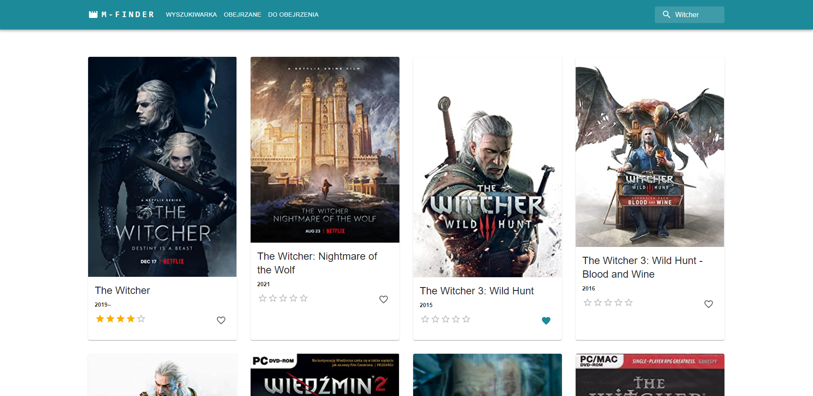
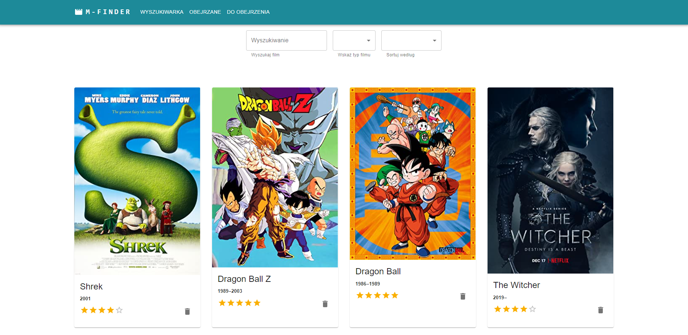

## Table of contents

- [General info](#general-info)
- [Technologies](#technologies)
- [Setup](#setup)

## General info

Movie Finder App. This project is simple movie finder. You can add movie to watched and for watch lists. You can rate and change rates.



## Technologies

Project is created with:

- React
- React Router DOM
- Redux (redux thunk, redux-persist)
- Material UI



## Setup

To run this project, install it locally using npm:

```
$ npm install
$ npm start
```
